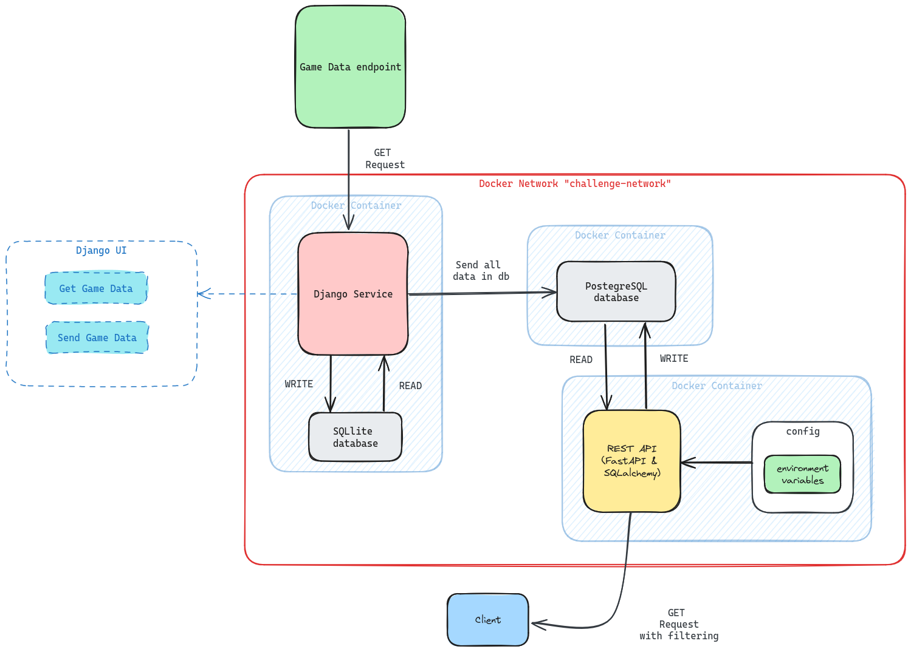
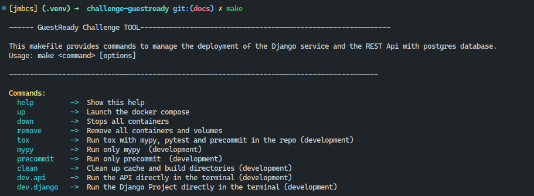
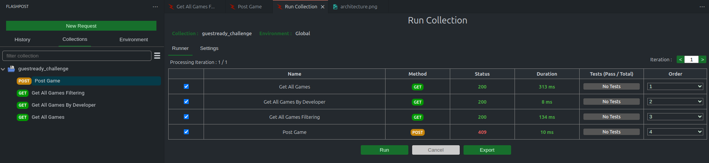
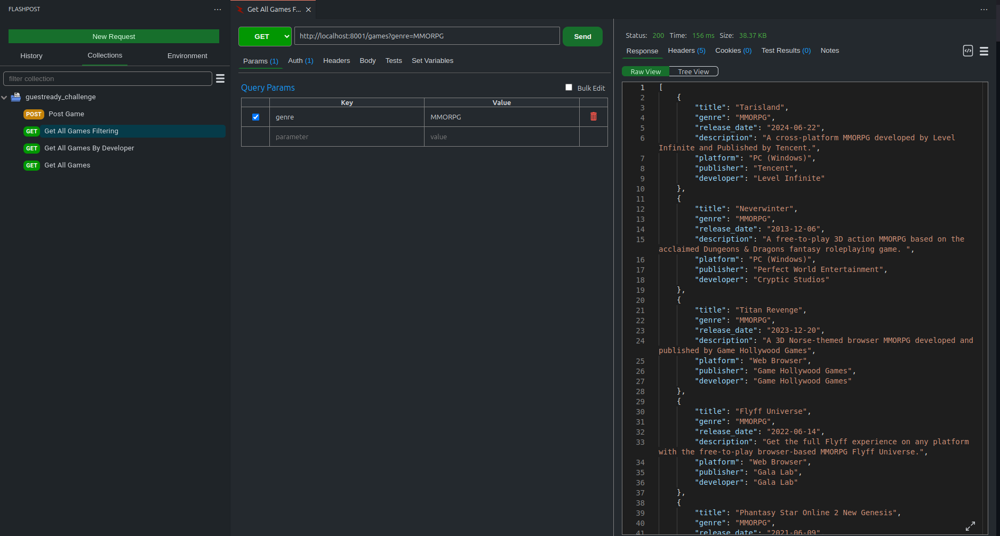
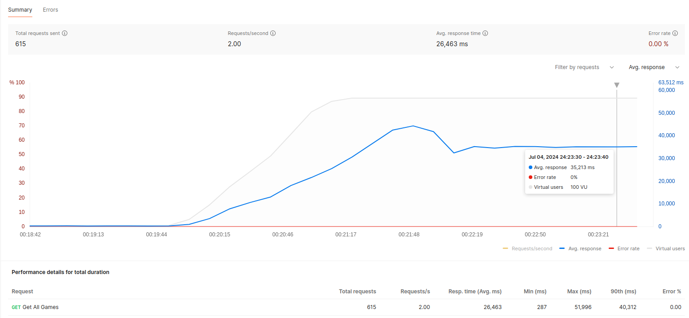
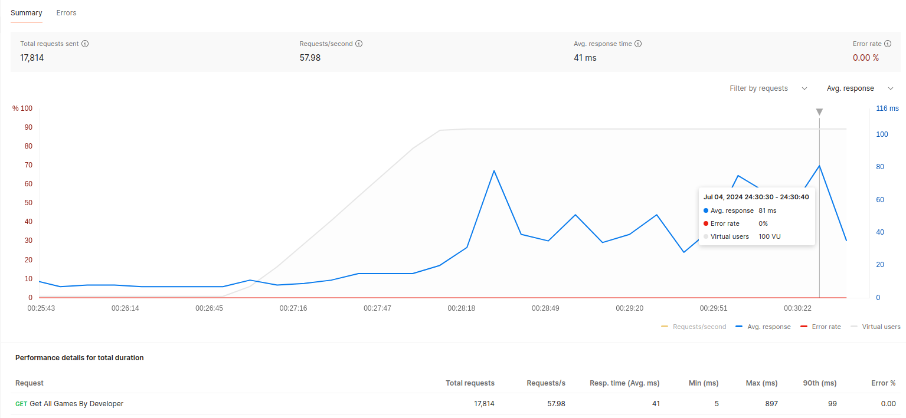
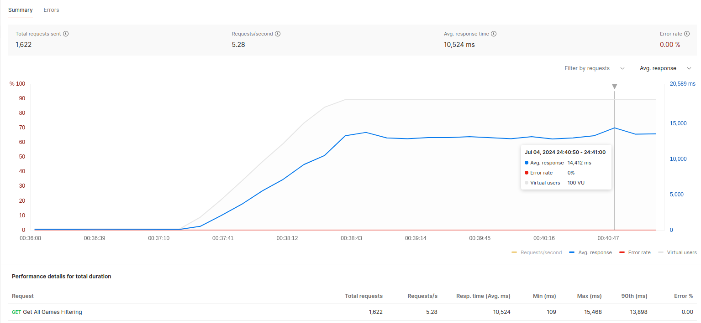
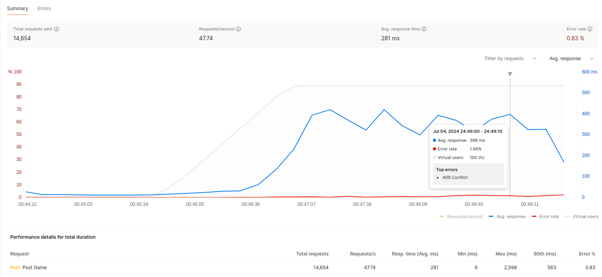
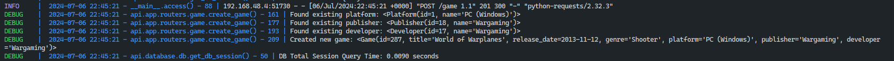
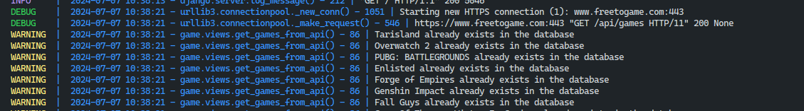

<!-- TOC --><a name="challenge-guestready-django-developer"></a>

# Challenge - Guestready - Django Developer

- Read the [CHALLENGE.md](CHALLENGE.md)

## Table of Contents

<!-- TOC start (generated with https://github.com/derlin/bitdowntoc) -->

- [Requirements](#requirements)
- [Quick Start and Deployment](#quick-start-and-deployment)
- [Proposed Solution Architecture](#proposed-solution-architecture)
  - [Key Features:](#key-features)
  - [Postgresql Initialization](#postgresql-initialization)
  - [Service Configuration](#service-configuration)
- [Available commands](#available-commands)
- [Setting Up Your Development Environment](#setting-up-your-development-environment)
  - [Development and Debugging](#development-and-debugging)
- [Testing - Code quality](#testing-code-quality)
- [Testing - FastAPI Response Performance](#testing-fastapi-response-performance)
- [Logging](#logging)
- [PostgreSQL Queries Optimization](#postgresql-queries-optimization)
- [Final Remarks and Suggestions](#final-remarks-and-suggestions)

<!-- TOC end -->

<!-- toc -->

<!-- TOC --><a name="requirements"></a>

## Requirements

- Docker Compose: `v2.28.1`
- Make: `v4.3`

<!-- TOC --><a name="quick-start-and-deployment"></a>

## Quick Start and Deployment

1. Clone this repo.

   ```bash
   git clone https://github.com/jmbcs/challenge-guestready.git
   ```

2. Run `make up`

   - If `make` is **not installed**, you can use the following command instead:

     ```bash
     docker compose -f docker-compose.yml up --build -d --wait
     ```

   - Wait for services to become `healthy` (this should take less than 30s after building the images).

3. Access Django at [http://localhost:8000](http://localhost:8000)
4. Access FastAPI at [http://localhost:8001](http://localhost:8001)
   - User: `guestready`
   - Password: `test123`
   - Documentation for endpoints can be found at [http://localhost:8001/redoc](http://localhost:8001/redoc)

Watch the video below as a reference for the `Django` + `FastAPI` interaction.


<hr>
<details>
  <summary>
    <strong>CLICK HERE</strong> to show video of Django + FastAPI.
  </summary>
  <p align="center">
    <video src="https://github.com/jmbcs/challenge-guestready/assets/112523386/002a0f38-587b-4627-a7cd-d1f6152b1ccd" controls width="640" height="360"></video>
  </p>
</details>
<hr>

<!-- TOC --><a name="proposed-solution-architecture"></a>

## Proposed Solution Architecture

<p align="center">
  
</p>

<!-- TOC --><a name="key-features"></a>

### Key Features:

- Each service runs in its own Docker container.
- Each service provides logs.
- Each service waits for their dependecy to become healthy.
  - **Example**: `FastAPI` service will only connect to `PostgreSQL` after the container reports to be `healhy`.
- Service configurations are managed via environment variables using `pydantic` basesettings.
- Services communicate within the Docker network but are also exposed on the host for easy access.
- Database migrations for PostgreSQL are handled by `alembic` integrated with `FastAPI`.
- PostgreSQL database initialization includes setting up users and databases for the REST API service.

<!-- TOC --><a name="postgresql-initialization"></a>

### Postgresql Initialization

- The `script` at `.docker-compose/initdb/initdb.sh` is passed into `/docker-entrypoint-initdb.d` which is automatically run when the container starts.
- Database migrations are applied when FastAPI connects to PostgreSQL using Alembic.

<!-- TOC --><a name="service-configuration"></a>

### Service Configuration

- Some environment variables are read from `.env`.

```yaml
environment:
  POSTGRES_USER: ${GUESTREADY__POSTGRES_USER?}
  POSTGRES_PASSWORD: ${GUESTREADY__POSTGRES_PASSWORD?}
  POSTGRES_API_DATABASE: ${GUESTREADY__API_POSTGRES_DATABASE?}
  POSTGRES_API_USER: ${GUESTREADY__API_POSTGRES_USER?}
  POSTGRES_API_PASSWORD: ${GUESTREADY__API_POSTGRES_PASSWORD?}
  PGDATA: /data/postgres
```

- FastAPI Service

```yaml
environment:
  guestready__api__auth__user: ${GUESTREADY__API_AUTH_USER?}
  guestready__api__auth__password: ${GUESTREADY__API_AUTH_PASSWORD?}
  guestready__api__port: "8001"
  guestready__logger__level: "DEBUG"
  guestready__logger__enable_log_color: True
  guestready__db__username: ${GUESTREADY__API_POSTGRES_USER?}
  guestready__db__password: ${GUESTREADY__API_POSTGRES_PASSWORD?}
  guestready__db__port: "5432"
  guestready__db__database: ${GUESTREADY__API_POSTGRES_DATABASE?}
  guestready__db__host: "postgres"
```

- Django Service

```yaml
environment:
  guestready__fastapi__auth__user: ${GUESTREADY__API_AUTH_USER?}
  guestready__fastapi__auth__password: ${GUESTREADY__API_AUTH_PASSWORD?}
  guestready__fastapi__url: ${GUESTREADY__API__URL?}
  guestready__games_url: ${GUESTREADY__GAMES__URL?}
  guestready__logger__level: "DEBUG"
  guestready__logger__enable_log_color: True
```

<!-- TOC --><a name="available-commands"></a>

## Available commands

Run `make` to check the available commands

<p align="center">
  
</p>

<!-- TOC --><a name="setting-up-your-development-environment"></a>

## Setting Up Your Development Environment

1. **Install `direnv`**: Visit [direnv.net](https://direnv.net/) and follow the installation instructions for your operating system.

2. **Initialize `direnv`**: After installing `direnv`, run the command `direnv allow` in your project directory. This allows `direnv` to load the environment variables and any script specified in `.envrc` into your shell session automatically.

3. **Automatic Dependency Installation**: Ensure all dependencies are installed automatically once `direnv` is set up.

<!-- TOC --><a name="development-and-debugging"></a>

### Development and Debugging

- You can run either Django or FastAPI APIs directly from the terminal:
  - **Run Django**: Execute `make dev.django` in your terminal.
  - **Run FastAPI**: Execute `make dev.restapi` in your terminal.

For detailed guidance on using `direnv` and setting up your environment using the `.envrc` file, refer to the following video:

<hr>
<details>
  <summary>
    <strong>CLICK HERE</strong> to show video of direnv.
  </summary>
  <p align="center">
    <video src="https://github.com/jmbcs/challenge-guestready/assets/112523386/7cda6642-c9f9-46e2-bd42-a1e4ff663cea" controls width="640" height="360"></video>
  </p>
</details>
<hr>

<!-- TOC --><a name="testing-code-quality"></a>

## Testing - Code quality

To ensure comprehensive code quality, the `make tox` command performs the following tasks:

1. Executes all `pytest` tests for `fastapi`, located at [services/restapi/tests](services/restapi/tests).
2. Executes tests for `django`, specifically targeting tests located at [services/django/django_project/game/tests.py](services/django/django_project/game/tests.py).
3. Runs Pre-commit hooks across the repository to automatically enhance code formatting and perform other necessary checks.
4. Validates proper Python code using `mypy`.

You can check the output of the command `make tox` by refering to the video below.

<hr>
<details>
  <summary>
    <strong>CLICK HERE</strong> to show video of make tox.
  </summary>
   <video src="https://github.com/jmbcs/challenge-guestready/assets/112523386/f4fe80d8-5a8e-4e3c-90af-3d257555db8a" controls width="640" height="360"></video>
  </p>
</details>
<hr>

<!-- TOC --><a name="testing-fastapi-response-performance"></a>

## Testing - FastAPI Response Performance

- If you have `Postman`, `Thunder Client` or `Flashpost`, you can import the provided collection file to run all tests:

  - [.postman/guestready_challenge.postman_collection.json](.postman/guestready_challenge.postman_collection.json)

- This will have some requests already setup that you can use to test the endpoints.
<p align="center">
  
</p>

- Example for a `GET` request

<p align="center">
  
</p>

<hr>
<details>
  <summary>
    <strong>CLICK HERE</strong> to show the peformance of the endpoint when receiving requests up to 100 Virtual Users (postman performance test).
  </summary>
  <p align="center">
    
    <br>
    This image displays the results of a test for retrieving all games.
        <br>
    <strong>GET</strong>: http://localhost:8001/games
    <br>
    <br>
    
    <br>
      This image illustrates the test results for retrieving games filtered by developer.
    <br>
    <strong>GET</strong>: http://localhost:8001/games/{developer}
    <br>
    <br>
    
    <br>
    In this image, the test results show games filtered based on certain criteria (with query params)
    <br>
    <strong>GET</strong>: http://localhost:8001/games
    <br>
    <br>
    
    <br>
    This image represents the test outcome of adding or posting a new game.
    <br>
    <strong>POST</strong>: http://localhost:8001/game
    <br>
  </p>
</details>
<hr>

<!-- TOC --><a name="logging"></a>

## Logging

- FastAPI service logs



- Django service logs.



**Note**:
You can configure the logging behavior using the following environment variables:

- `guestready__logger__level`: Set the desired logging level (e.g., "DEBUG").
- `guestready__logger__enable_log_color`: Toggle to enable or disable log coloring (e.g., True or False). (log color should be disabled if you want to store logs in files)

<!-- TOC --><a name="postgresql-queries-optimization"></a>

## PostgreSQL Queries Optimization

The queries have been optimized using SQLAlchemy ORM. Optimization involved setting indexes on `developer`, `release_date`, `genre`, and `platform` columns, as these are frequently used for filtering.

<!-- TOC --><a name="final-remarks-and-suggestions"></a>

## Final Remarks and Suggestions

1. **Consolidate Configurations**:

   - Streamline management by consolidating configurations for both the Django server and FastAPI into a single `.toml` file.

2. **Refine `tox.ini` Configuration**:

   - Enhance the effectiveness of the `tox.ini` file with a more refined configuration.

3. **Adopt `pytest` for Testing**:

   - Consider using `pytest` for testing in Django alongside the traditional `manage.py test` approach to leverage its advanced features.

4. **Implement Versioning**:

   - Add some form of versioning to the different services to keep track of changes and updates.

5. **Secure Credential Management**:

   - Ensure that credentials are not stored in `.env` files for improved security.

6. **Local Installation of Frontend Libraries**:
   - Avoid using CDN for frontend libraries like `htmx`, `tailwind`, and `daisyui` due to security concerns. Instead, install them locally.
